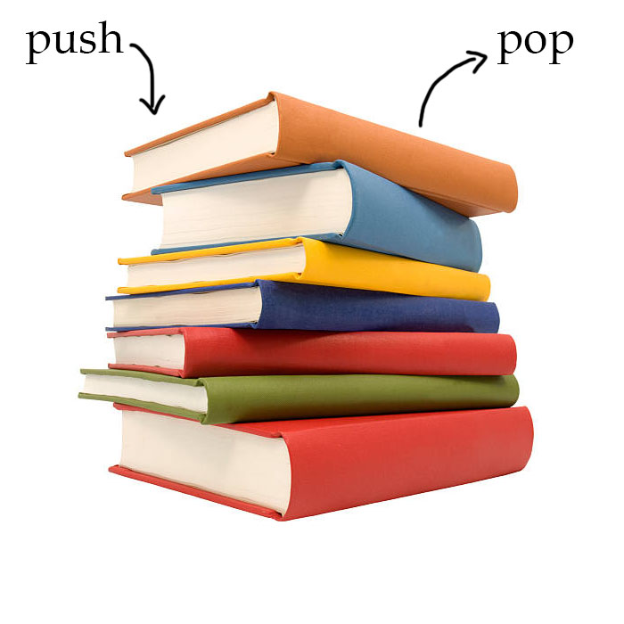

# Stack

## Introduction

Stack is the first datatype we're going to learn about. It is similar to a list in Python, in fact we use a list to make it work, but it has some features that work a little differently. 

## Last In, First Out

First, think about how a stack of books work. You set one book down, and then another on top of it, and another on top of that. To get to the first book you put in, you need to first take off the last two books. This is similar to how a stack works in Python. Each piece of data that goes into the stack, comes off in the opposite order it was put on. In other words the last one in is the first one out. 

## Common Operations

To put data into our stack and take it off of our stack, instead of using "insert" and "delete", we use `push` and `pop` operations. 
The `push` operation pushes the data onto the stack, and the `pop` operation takes the last piece of data off the top of the stack. 

The `push` operation doesn't return a value, as it's just setting the value into the stack. When you `pop` the last item off it returns the value of the data. For example, when you call `pop` you can put it in a variable to use, print it, or you can leave it be. 



## How to Use Stacks in Python

Python has a lot of built in support for using a Stack. In fact, it can be done entirely by using Lists in Python. Here are some common operator names for using a Stack, along with the Python code that corresponds to using it in a list. 

Function Name | Description | Python Code | Performance
------------- | ----------- | ----------- | -----------
Push          | Adds the value to the stack | stack.append(value) | O(1)
Pop           | Removes from stack and returns the value | value = stack.pop() | O(1)
Size          | Returns the size of the stack | length = len(stack) | O(1)
Empty         | If the stack is empty (length of 0), this returns true | if len(stack) == 0: | O(1)

Here's a basic example of a stack you may see in Python:

```python
stack = []

stack.append(1)
stack.append(2)
stack.append(3) 

while len(stack) != 0 # Loop while the stack is not empty
    print(stack.pop())
    # Output:
    # 3
    # 2
    # 1
    # Then the stack is empty, and will finish printing. 
```
## Problem to Solve

Now it's your turn to create and implement a stack! Stacks are most useful for 'undo'ing work that's been done on the computer. For example, it can be used in a maze solving program to backtrack, or to reverse a string, or to undo words typed into a text editor. Today, we will be creating a program that uses a stack to reverse a string. 

### Steps

1. Create an empty stack.
2. Get a string input from the user.
3. Display the string backwards. See if you can display them all on one line.
   - Hint: There's an end condition that can be changed in the print statement.

### Solution
After creating your Python program, compare your solution [here](stack.py). What did you do the same or differently? What other uses can you think of for using a stack in programming?  