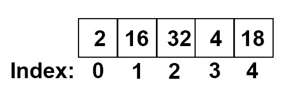
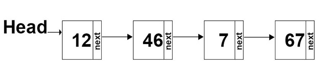
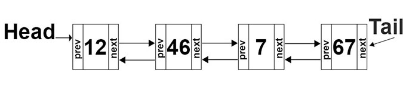
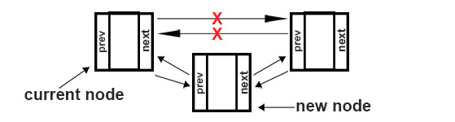

# Linked List

## Introduction

Linked Lists are similar to lists in Python, but with a few twists. In a regular list, data is inserted into a list, and is accessible by an index where the data lives. Linked Lists have a similar structure, but are implemented a different way. Instead of using an index to find data, the data is connected together in a line by pointing to the next set of data. 

### List Structure:



## Linked List Structure

Each set of data in this linked list is called a `node`. Within the node is a `pointer` that points to the next value in the linked list. At the beginning is the head, which is an empty node that points to the first data in the Linked List. 



To read data forwards and backwards, use a doubly linked list. This includes a `tail` at the end pointing to the final node, another pointer, `prev`, which points to the previous node, and all nodes point forwards and backwards.



Linked Lists may be used in programming when you're worried about overflow, or putting data into a list that doesn't have the space for it. This is more of an issue with other programming languages other than Python, where lists or arrays usually have a static amount of memory that's allocated for them. A Linked List can grow or shrink as you need it. Not used frequently in Python, but it's important to know how to use a linked list. 

In the real world, Linked Lists can be used for using 'back' and 'forward' in browser history, as an image viewer with next and previous buttons, and for music players as well. 

## Insert, Remove, Access Values

There are three main actions we can take with a Linked List: insert, remove, and access our data. When inserting or removing data, pointers need to be moved around to accommodate room for our new node, or deleting a node. 

### Insert Into a Linked List

There are three ways to insert into a Linked List

1. Insert at the Head
2. Insert at the Tail
3. Insert in the Middle

The main steps to do each of these are as follows:

1. Create a new node
2. If you are **inserting at the head**, set the `next` pointer of the new node to where the head is currently pointing. I.e. `new_node.next = self.head`
    - If you are **inserting at the tail**, set the `prev` of the new node to where the tail is currently pointing. I.e. `new_node.prev = self.tail`
3. If you are **inserting at the head**, then set the `prev` pointer to the current head. `self.head.prev = new_node`
    - If you are **inserting at the tail**, set the `next` pointer to the current tail. `self.tail.next = new_node`
4. Next, set the head or the tail to point to your new node. `self.head = new_node` or `self.tail = new_node`

To insert into the middle requires a few more steps than inserting at the head or the tail. 
1. Create a new node
2. Set the `prev` pointer of the new node to the current node. `new_node.prev = current`
3. Set the `next` pointer of the new node to the next node after the current node. `new_node.next = current.next)`
4. Set the `prev` of the `next` node after current to the new node `current.next.prev = new_node`
5. Set the next of the current node to the new node. `current.next = new_node`

To say all that in layman's terms, you create your node, find where you want to put it in your list, point your `prev` pointer at that node, point your `next` pointer where the current node is pointing, move the next's `prev` pointer to point at your new node, and move the current node's `next` to point at your new node. 



### Removing From a Linked List

To remove from a Linked List, we need to play around with pointers again!

1. If you are **removing from the head**, set the `prev` of the next node to nothing. `self.head.next.prev = None`
   - If you are **removing from the tail**, set the `next` of the second to last node to nothing. `self.tail.prev.next = None`
2. Set the head to point at the second node. `self.head = self.head.next`
    - Or set the tail to point to the second to last node. `self.tail = self.tail.prev`

To remove from the middle of a Linked List, you guessed it, we're playing with pointers again. This time it's simple, as you just need to reassign the pointers on either side of the new node.

1. Set the `prev` pointer of the next node to the previous of your current node. `current.next.prev = current.prev`
2. Set the `next` pointer of the previous node to the node after your current node. `current.prev.next = current.next`

### Accessing from a Linked List

To traverse a Linked List, we can write a function to handle it. We can start at the head or the tail and loop through the list until we get to the end.

```python
def forward(self, data):
    # Start at the beginning
    current = self.head

    # Keep going until we have reached the end
    while current is not None:

        # Here you can do something with the current node
        if data == current.data:
            print(current.data)

        #Go to the next node
        current = current.next
```

## Examples in Python

Python has its own Linked List available to use! You can use it by including `from collections import deque` at the top of your program. Then create a linked list: `linked_list = deque()`

Here are some common functions used in Python's deque:

Function Name | Description | Python Code | Performance
------------- | ----------- | ----------- | -----------
Insert at the head | Inserts a value at the head | linked_list.appendleft(value) | O(1)
Insert at the tail | Inserts a value at the tail | linked_list.append(value) | O(1)
Insert a value in the middle | Inserts the value after node 'i' | linked_list.insert(i, value) | O(n)
Remove head | Removes the first item | value = linked_list.popleft() | O(1)
Remove tail | Removes the last item | value = linked_list.pop() | O(1)
Remove specific value (Delete) | Removes a value | del linked_list[i] | O(n)
Size | Returns the size of the linked list | length = len(linked_list) | O(1)
Empty | Returns true if the length is zero | if len(linked_list) == 0 | O(1)

## Problem Solved using Linked List

A Linked List in Python can be used to create a Stack. I created some example code to view below. A list of numbers to create our stack is appended onto a new linked_list, which is returned. It can then be used to pop off numbers from the end. 

```python
from collections import deque

# Append a list onto our stack
def stack_append(list):
    linked_list = deque()
    
    for num in list:
        linked_list.append(num)

    return linked_list
    

def main():
    my_list = [0, 1, 2 ,3, 4, 5]
    stack = stack_append(my_list)
    
    print(stack)

    while len(stack) != 0:
        print(stack.pop())

main()
```

The output of the above shows what is in Python's deque, and then the result of the numbers popping off in reverse order, just like we did last lesson. 

```
deque([0, 1, 2, 3, 4, 5])
5
4
3
2
1
0
```

## Problem to Solve

A Linked List in Python can also be used to create another type of Data Structure - Queues. A Queue is similar to a Stack. But as you remember, a stack follows **Last In, First Out** method. A queue is more like a line to get ice cream or see a movie, which follows a **First In, First Out** method. 

Let's create a program to implement a Queue using Python. Copy and paste this code, and add your own code to implement our linked list as a queue:

```python
from collections import deque

def create_queue(list):
    """Using a list, add data onto a deque. Return the deque to the user."""

def main():
    """Create a list. You could receive input from the user or create your own list.
    Use that list to call the create_queue function. Print the contents of the queue, then 
    take the items out in First In, First Out order, and print them to the screen."""

main()
```

After writing your program, you can look at a [solution here](linked_list.py). 