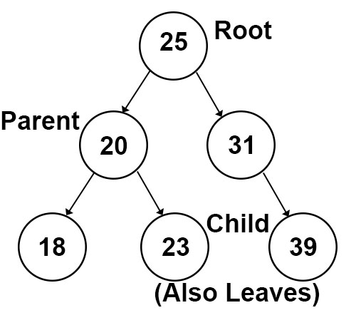
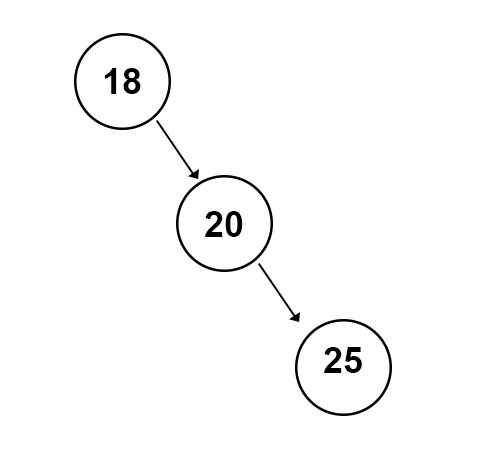

# Binary Search Trees

## Introduction
Trees are linked lists that can point to more than one node. There are multiple types of trees: binary trees, binary search trees, and balanced binary search trees. We are going to focus on binary search trees today, but first will need to learn a little bit about recursion to make that happen. 

## Basic Recursion
Recursion is using a function to call itself to find an answer. The most important thing you should remember when writing a recursive function is to start with a base case. How do you get your answer? 

Let's look at a quick example:

```python
def adding_num(n):
    # This is the base case. If n is less than or equal to 1, just return 1, and the function ends.
    if n <= 1:
        return 1

    # This is the meat of the problem. In this case, we are going to add n + n-1 + n-2 + n-3... until you 
    # get to 1. 
    # Example: 5 + 4 + 3 + 2 + 1 = 20
    else:
        return n + adding_num(n-1) 
```
Just remember to set your base case first or it will loop forever!

## Tree Structure
Binary Trees have nodes with two pointers. It begins with a `root` node, and each side it points to is a `subtree`. A node with connected nodes is called a `parent` node, and the nodes it's connected to are called `child` nodes. Nodes that connect to no other nodes are called `leaf` nodes.



## Binary Search Tree
A Binary Search Tree follows the same rules for a binary tree, but its nodes have numbers in them. They are sorted based on when they are inserted into the list. If the number is less than the parent node, it is inserted into the left side of the tree, and if it's a higher number, it goes into the right side of the tree, and continues that search until it finds a place. You can see this structure in the image above. 

A case that would cause this tree to be unbalanced is if every subsequent number inserted was higher than the last. Then you would always be searching to the right, and the tree would become unbalanced. 



## Insert Into BST
To insert into a binary search tree, you use recursion. Let's think of the base case first: when do you insert into a tree? When a space is empty. How do you find the spot? You go either to the left or right subtree. 

Base Case: If there is space to add the node, the correct spot has been found and can be inserted.

Problem: Choose either the right or left tree to add the node to.

## Examples in Python
We can use Python to create a Binary Search Tree. There are user-made modules you can use in Python to create them, but we can set up a simple one from the start. 

```python
class BST:
    # When we initialize BST, we first need to set root to None
    def __init__(self):
        self.root = None
    
    # This __iter__ function is how we will iterate through our BST and be able to print what's in it.
    def __iter__(self):
        yield from self._forward(self.root)
        
    # The __iter__ function calls this, and we call it recursively to get all values out of it.
    # Base case: If node IS none, return nothing
    # Otherwise, we need to go both left and right recursively to find all our branches in the tree
    def _forward(self, node):
        if node is not None:
            yield from self._traverse_forward(node.left)
            yield node.data
            yield from self._traverse_forward(node.right)

    # This class holds our Node, which has left, right, and our data
    class Node:
        def __init__(self, data):
            self.left = None
            self.right = None
            self.data = data
        def __str__(self):
            return str(self.data)
    
    # This is how we start to call insert. We call the _insert function recursively to find where our data should go
    def insert(self, data):
    if self.root is None: 
        self.root = BST.Node(data)
    else:
        self._insert(data, self.root)

    def _insert(self, data, node):
        # If data belongs on the left:
        if data < node.data:
            if node.left is None: # BASE CASE: We found an empty spot and can insert the data here
                node.left  = BST.Node(data)
            else: # Recursively insert into the left side
                self._insert(data, node.left)
        
        # If data belongs on the right:
        elif data >= node.data:
            if node.right is None: # BASE CASE: We found and empty spot and can insert the data here
                node.right = BST.Node(data)
            else: # Recursively insert into the right side
                self._insert(data, node.right)

```
Above is our basic BST class that allows us to insert numbers. It doesn't care about being balanced or adding duplicate numbers. It does let us insert and print each number in our BST. Study this code and see if you can figure out how it works. After you've figured that out, we can move on to our next step. 

## Problem to Solve

The next step is to use the code above and to add code to check if it already contains a number. Here is a shell you can use to add to the code above:

```python
def __contains__(self, data):
        return self._contains(data, self.root)

def _contains(self, data, node):
    # Your code here
    pass
```

After writing your program, you can look at a [solution here](bst.py).